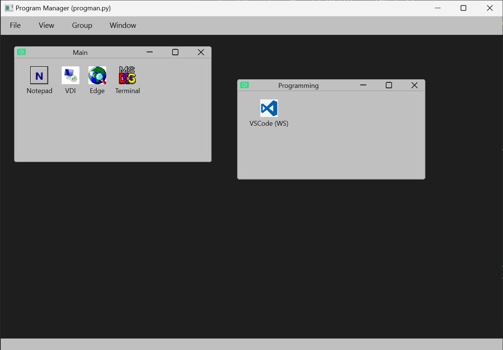

# progman-py

A cross-platform, PyQt6-based recreation of the Windows 3.x Program Manager. The app organizes shortcuts into groups, lets you edit them in a retro-inspired interface, and launches them with the classic Program Manager feel.



## Features
- **Classic or system theming:** Switch between default Qt styling and a custom palette that mimics Windows 3.x colors.
- **Organized shortcuts:** Create, rename, or delete program groups and add launchable items with custom titles, commands, icons, and working directories.
- **MDI workspace:** Each group opens in its own QMdiSubWindow inside a Multiple Document Interface so you can tile or cascade windows like the original Program Manager.
- **Fallback icons:** Auto-generated retro icons for entries without custom artwork.
- **Persistent configuration:** Stores groups, items, theme choice, and window layout in `~/.progman.json` by default.

## Project layout
- `progman.py`: Main application entry point and all UI/model code.
- `icons/`: Optional icon assets (not required because fallback icons are drawn at runtime).
- `build.sh` / `build.cmd`: Convenience wrappers around the PyInstaller build command (Linux/macOS vs. Windows).

## Getting started
1. Install Python 3.10+.
2. Install dependencies:
   ```bash
   pip install -r requirements.txt
   ```
3. Run the app:
   ```bash
   python progman.py
   ```

The first launch writes a default configuration to `~/.progman.json` if none exists, including example items for quick testing.

## How it works (code walkthrough)
- **Theme management:** `ThemeManager.apply` switches between the system look and a “classic” palette/stylesheet, tweaking colors and font size for a retro feel.
- **Fallback icons:** `make_classic_fallback_icon` draws a 32×32 icon on the fly with a gray tile, dark border, and a blue initial so every item has an icon even without bundled assets.
- **Data models:** `ProgramItem` and `ProgramGroup` dataclasses provide JSON-friendly `to_dict`/`from_dict` helpers for persisting titles, commands, working directories, and optional icon paths.
- **Application model:** `AppModel` handles loading/saving configuration, validating theme names, and remembering the MDI layout between runs.
- **Launcher:** `Launcher.launch` starts the selected command (respecting an optional working directory) and surfaces errors with a message box if spawning fails.
- **Editing UI:** `ProgramItemDialog` offers labeled fields and browse buttons for editing items, enforcing required title/command input before returning changes.
- **Group windows:** `GroupWindow` renders items as an icon grid, supports double-click launches, and provides context menus for creating, editing, refreshing, or deleting items.
- **Main window:** `MainWindow` builds menus for file/view/options/window actions, manages group creation/renaming/deletion, toggles themes, and restores/saves QMdiSubWindow state across sessions.

## Configuration
- **File location:** `~/.progman.json` by default (changeable by editing `AppModel.config_path`).
- **Themes:** `system` (default) or `classic`. Switch via **View → Theme** in the menu.
- **Items:** Each entry stores `title`, `command`, optional `working_dir`, and `icon_path`. Icons may point to `.ico` or other image formats supported by Qt.

## Building a single-file executable with PyInstaller
PyInstaller can bundle the application and Python runtime into a single executable.

1. Install build dependencies (in a virtual environment if desired):
   ```bash
   pip install -r requirements.txt
   pip install pyinstaller
   ```
2. Run PyInstaller using the provided flags (also available in `build.sh`/`build.cmd`):
   ```bash
   pyinstaller --noconfirm --clean --windowed --onefile --name progman progman.py
   ```
3. Find the resulting executable in the `dist/` directory (e.g., `dist/progman` on Linux/macOS or `dist/progman.exe` on Windows).
4. On Windows, you can run the same command via `build.cmd`; on Linux/macOS, use `build.sh`.

## License
This project is licensed under the MIT License. See [LICENSE](LICENSE) for details.
