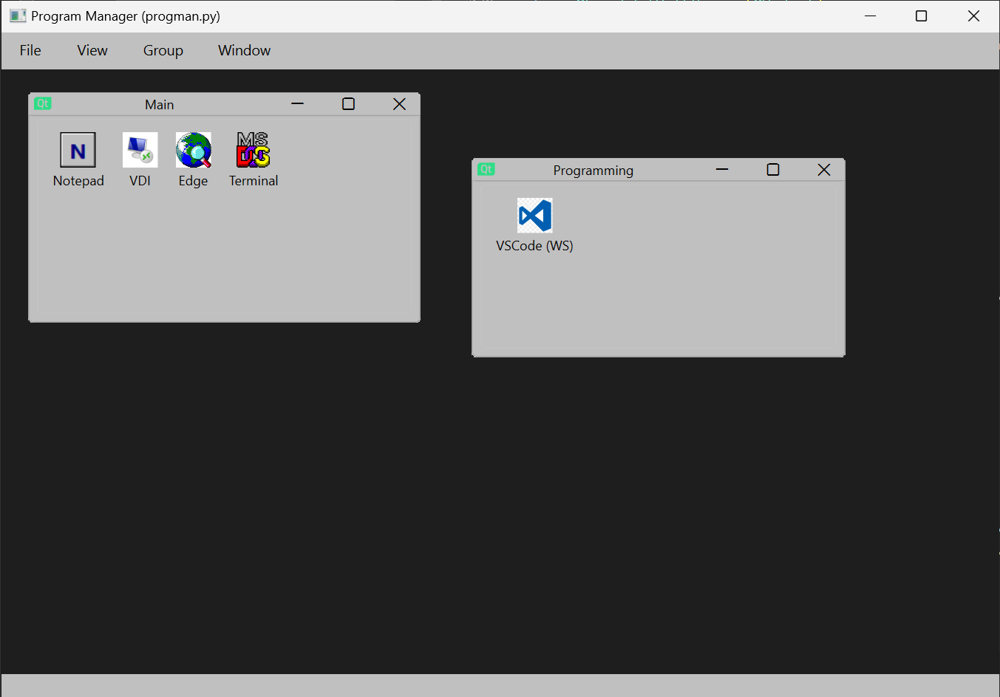

# progman-py

A cross-platform, PyQt6-based recreation of the [Windows 3.x Program Manager](https://en.wikipedia.org/wiki/Program_Manager). The app organizes shortcuts into groups, lets you edit them in a retro-inspired interface, and launches them with the classic Program Manager feel.



## Features
- **Light and dark themes:** Toggle between light and dark mode via the View menu (Ctrl+D).
- **Organized shortcuts:** Create, rename, or delete program groups and add launchable items with custom titles, commands, icons, and working directories.
- **MDI workspace:** Each group opens in its own QMdiSubWindow inside a Multiple Document Interface so you can tile or cascade windows like the original Program Manager.
- **Drag-and-drop:** Reorder items within a group or drag items between groups to reorganize.
- **Program scanner:** Scan for installed applications on your system (Linux .desktop files, Windows Start Menu, macOS Applications) and add them with one click.
- **Auto-update:** Checks GitHub for new releases and can download, build, and install updates.
- **Fallback icons:** Auto-generated theme-aware icons for entries without custom artwork.
- **Persistent configuration:** Stores groups, items, theme choice, and window layout in `~/.progman.json`. Automatically migrates older config formats.

## Project layout
```
progman-py/
├── main.py                  # Entry point
├── progman/                 # Main package
│   ├── __init__.py
│   ├── version.py           # Version string (single source of truth)
│   ├── app.py               # MainWindow, UpgradeWorker, UpgradeProgressDialog
│   ├── models/              # Data models (ProgramItem, ProgramGroup, AppModel)
│   ├── widgets/             # UI widgets (GroupWindow, ProgramItemDialog, ScanDialog)
│   ├── utils/               # Utilities (config, icons, launcher, scanner, theme, updater)
│   └── workers/             # Background workers (ScanWorker)
├── tests/                   # Comprehensive test suite
├── icons/                   # Optional icon assets
├── screenshots/
├── build.sh / build.cmd     # Build scripts
├── requirements.txt         # Runtime dependencies
└── requirements-dev.txt     # Development/test dependencies
```

## Getting started
1. Install Python 3.10+.
2. Install dependencies:
   ```bash
   pip install -r requirements.txt
   ```
3. Run the app:
   ```bash
   python main.py
   ```

The first launch writes a default configuration to `~/.progman.json` if none exists, including example items for quick testing.

## Running tests
```bash
pip install -r requirements-dev.txt
QT_QPA_PLATFORM=offscreen pytest tests/ -v
```

Tests run headless using the `offscreen` Qt platform adapter and use temporary config files to avoid affecting your actual configuration.

## How it works

### Theming
`ThemeManager` in `progman/utils/theme.py` defines centralized light and dark stylesheets. All colors are constants at the top of the class, used in QSS stylesheet templates. Toggle via View > Dark Mode (Ctrl+D).

### Data models
`ProgramItem` and `ProgramGroup` dataclasses provide JSON-friendly `to_dict`/`from_dict` helpers. `AppModel` handles loading, saving, and migrating configuration.

### Config migration
When loading a config file, `AppModel` checks the `config_version` field. Old configs (pre-v1) that used `theme: "system"|"classic"` are automatically migrated to the new `dark_mode: bool` format with added `github` and `config_version` fields.

### Drag-and-drop
`GroupWindow` enables Qt drag-and-drop on its `QListWidget`. Within-group reorder uses standard Qt DnD. Cross-group transfer uses a module-level `_drag_state` dict to track the dragged item and source group during the single-threaded Qt drag operation.

### Program scanner
Platform-specific scanner in `progman/utils/scanner.py`:
- **Linux:** Parses `.desktop` files from standard locations, maps FreeDesktop categories to friendly group names.
- **Windows:** Walks Start Menu folders, parses `.lnk` files via PowerShell (no pywin32 dependency).
- **macOS:** Walks `/Applications/`, parses `Info.plist` with `plistlib`.

The scan runs in a background `QThread` and results appear in a dialog with checkboxes and editable group names.

### Auto-updater
Uses the GitHub public API (no authentication required) to check for new releases. Respects a 7-day check interval. On upgrade, downloads the release zip, extracts it, finds the build script, and runs it.

## Configuration
- **File location:** `~/.progman.json`
- **Theme:** `dark_mode` (boolean). Toggle via View > Dark Mode.
- **Items:** Each entry stores `title`, `command`, optional `working_dir`, and `icon_path`.
- **Version check:** Timestamp stored in `~/.progman/.version_check`.

## Building a single-file executable with PyInstaller
```bash
pip install pyinstaller
./build.sh        # Linux/macOS
build.cmd         # Windows
```
The resulting executable appears in `dist/progman` (or `dist/progman.exe` on Windows).

## License
This project is licensed under the MIT License. See [LICENSE](LICENSE) for details.
